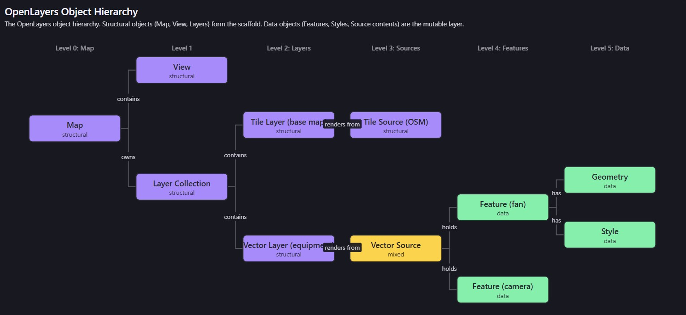

# OpenLayers Architecture for Operational Maps

This lesson investigates the OpenLayers object model to answer a critical performance question: when thousands of equipment statuses change simultaneously, what can you safely mutate at 60fps? You will examine the OpenLayers rendering pipeline, classify objects by their lifecycle and mutability, and walk through a concrete status update to understand the boundary between structural objects and transient data.

> **Learning Objectives**
> - Classify OpenLayers objects as long-lived structural or mutable data objects
> - Trace a live equipment status change through the object hierarchy to identify exactly which objects change and which remain untouched
> - Recognize and diagnose common performance pitfalls when updating map state during live data streams
> - Explain how Angular's change detection interacts with OpenLayers and where the ownership boundary should live

## The Performance Challenge
Picture a tunnel control room. The operator's screen shows a corridor map with 10,000 equipment items overlaid: ventilation fans, cameras, pumps, emergency phones, variable-message signs, air quality sensors, fire detectors. Each item has a status—normal, warning, alarm, offline—that changes color on the map when it changes in the field.

Now imagine a scenario that tunnel control system designers plan for: a ventilation malfunction cascades through 300 fans in two seconds. Each fan transitions from 'normal' (green) to 'alarm' (red). The SCADA backend pushes 300 WebSocket messages. Your map must update all 300 markers, keep rendering at 60fps, and not block the Angular change-detection cycle.

Before reading on, consider: when a single ventilation fan changes from 'normal' to 'alarm,' which OpenLayers objects would you mutate? Would you recreate the layer? Move the camera? Replace the feature? Change a style on an existing feature? Write down your prediction.

Hold that prediction. The question matters because OpenLayers is an imperative library living inside Angular's declarative component model. Angular's zone-based change detection watches component state for mutations. If your status update path touches Angular-managed objects, every one of those 300 updates can trigger change-detection cycles across your component tree. The naive approach—treating the map like a template that re-renders when inputs change—can turn a 2-second event burst into a multi-second browser freeze.

Here is the tempting but wrong model: treat OpenLayers like Angular's template system. You might assume the framework re-renders the map when you change a component property, just like Angular re-renders a template when an @Input changes. You might also assume that all OpenLayers objects are equally mutable—that you can freely change the Map, View, Layer, Source, or Feature at any time with the same cost.

Before we correct this, try to predict what goes wrong: If you treated every OpenLayers object as equally cheap to mutate, what specifically would break when 300 fans update simultaneously? Would the browser freeze? Would features disappear? Would the map pan to the wrong location? Think about what 'mutate' means for each object type.

> **Misconception: Framework Does the Rendering**  
> It seems plausible that OpenLayers works like Angular's template engine—set a property, framework detects the change, rendering happens automatically. This breaks down because OpenLayers is an imperative, retained-mode library. It does not observe your data for changes. You must explicitly call methods to mutate state and trigger rendering. If you set a property on a plain JavaScript object, the map will not update. OpenLayers objects own their own internal state and rendering schedule; they are not reactive. Confusing the two models leads to code that either never updates the map or triggers redundant renders by manually calling methods that Angular's change detection also tries to process.

## The Object Hierarchy

OpenLayers is not a flat collection of objects. It is a layered hierarchy where each level has a distinct responsibility. Understanding this tree structure is the key to answering which objects you can safely mutate during a status-update storm.

At the top sits the Map. It owns the DOM container, the rendering loop, and the collection of layers. Below the Map is the View, which defines the projection, center, and zoom. The Map also holds a set of Layers, each of which holds a Source, which holds Features, each of which holds a Geometry and a Style.



Think of the separation this way: Angular component templates define structure—components, directives, bindings—that lives until the component is destroyed. Data flows through that structure via @Input properties and event handlers. The template does not get recreated every time data changes. OpenLayers works similarly: the Map, View, and Layers are the template—the structural scaffold that lives for the component's lifetime. Features and their styles are the data that flows through that scaffold.

Now here is the question this diagram raises: if the hierarchy has both structural and data layers, where does a status update belong? Before reading on, look at the hierarchy and predict: when a fan changes from 'normal' to 'alarm,' which objects in this tree need to change? Which must remain untouched?

You might be tempted to view this as a flat object graph—every object at the same level, every mutation equally cheap. Try that model: if you treated the Map, View, Layer, Source, and Feature as equally mutable, what would happen if you recreated all of them for each of 300 fan status changes? The structural objects would be torn down and rebuilt 300 times in two seconds, each rebuild triggering DOM manipulation, projection recalculation, and layer re-initialization. The browser would freeze.

> **Misconception: Flat Object Graph**  
> It is tempting to think of OpenLayers objects as a flat, equally-weighted collection where mutating any object has the same cost. This fails because the hierarchy is not flat—structural objects (Map, View, Layers) are expensive to create and cheap to query, while data objects (Features, Styles) are cheap to create and cheap to mutate. Treating them as peers leads to recreating expensive structural objects when only a data-level change was needed, causing cascading re-initialization and DOM thrashing during live updates.

## Object Responsibilities and Lifecycle Classification
The hierarchy diagram gives us a mental picture, but to make engineering decisions we need precise responsibilities. Each OpenLayers object type has a specific role in the rendering pipeline, and understanding those roles tells us what we can safely mutate when 300 fans change state.

OpenLayers' package structure mirrors this hierarchy. The core ol package exports the Map. Under ol/layer you find TileLayer and VectorLayer. Under ol/source you find TileSource and VectorSource. Under ol/geom you find Point, LineString, and Polygon. This is not just file organization—it reflects the containment and dependency relationships in the object model.

Consider what happens when you create each object type. A Map initializes a renderer, attaches to a DOM element, and sets up a frame-based rendering loop. A View computes a projection matrix from its center, zoom, and rotation. A Layer configures its rendering style (canvas, WebGL) and binds to a source. A Source manages a spatial index for efficient feature lookup. A Feature stores a geometry reference and a set of key-value properties. Each of these has a different construction cost and a different mutability profile.

Now consider: which of these would you want to create once and keep for the entire component lifecycle? Which would you expect to change when equipment status changes?

The Map, View, and Layers are the scaffold. They are created once during component initialization and destroyed when the component is removed. The Source object itself is also long-lived—you add and remove features from it, but you do not recreate it. The Features, their properties, and their styles are the mutable data layer.

> **Object Classification**  
> Structural (long-lived): Map, View, Layer (Tile/Vector), Source — created once during initialization, destroyed on component teardown. Data (mutable): Feature properties, Feature styles, Geometry — updated in place during live status changes.

Now, a question to check this classification: when a ventilation fan changes from 'normal' to 'alarm,' which long-lived object holds the feature you need to update? And which mutable object on that feature carries the visual state change?

``` TypeScript
// Domain model: typed equipment objects for tunnel control
// These are plain TypeScript interfaces — NOT OpenLayers objects.
// They represent the backend data model that flows into OpenLayers features.

export type EquipmentType =
  | 'ventilation_fan'
  | 'camera'
  | 'pump'
  | 'sensor'
  | 'vms'
  | 'emergency_phone'
  | 'fire_detector';

export type EquipmentStatus =
  | 'normal'
  | 'warning'
  | 'alarm'
  | 'offline'
  | 'maintenance';

export interface TunnelEquipment {
  id: string;                  // unique equipment identifier
  type: EquipmentType;
  status: EquipmentStatus;
  location: [number, number];  // [lon, lat] in EPSG:4326
  tunnelId: string;
  laneId?: string;
  lastUpdated: number;         // epoch milliseconds
}

// Status-to-style mapping lives in a style function, not in the domain model.
// The feature's properties carry the status; the style function interprets it.
export const STATUS_COLORS: Record<EquipmentStatus, string> = {
  normal:       '#22c55e',  // green
  warning:      '#f59e0b',  // amber
  alarm:        '#ef4444',  // red
  offline:      '#6b7280',  // gray
  maintenance: '#3b82f6',  // blue
};

```

Notice the separation: the domain model is pure TypeScript. It knows nothing about OpenLayers. The OpenLayers Feature is a separate object that holds a reference to this data via its properties. When the status changes, you update the feature's properties and let a style function interpret the new status to produce the correct visual representation.

Before moving to the worked example, consider this classification question: you might think the Layer object holds the equipment status data directly, so updating a status means updating the layer. But look back at the hierarchy—the Layer does not hold data. It holds a Source, which holds Features. The layer is structural configuration. Where does the actual status data live?

> **Misconception: Layer Is State**  
> It is easy to assume the Layer object stores the equipment state, since the layer is what you see on screen. But the Layer is structural—it defines rendering configuration (canvas vs. WebGL, min/max zoom, opacity). The actual equipment state lives in Features on the Source. Updating a status by recreating the Layer is like rebuilding a bookshelf every time you want to change one book's cover. The Layer is the shelf; the Feature is the book; the Style is the cover.

## A Single Fan Status Change

Let us make this concrete. You have a vector layer with 200 ventilation fans distributed along a tunnel corridor. Each fan is a Feature on a VectorSource. Each Feature has a Point geometry (the fan's location) and a property bag containing { id, type, status }. A style function reads the status property and returns the appropriate color.

One fan—id FAN-0073—changes from 'normal' to 'alarm'. Here is what happens, step by step.

Step 1: The WebSocket message arrives. Your Angular service parses it into a TunnelEquipment update: { id: 'FAN-0073', status: 'alarm' }. At this point, nothing on the map has changed.

Step 2: You need to find the existing feature for FAN-0073. The VectorSource has a getFeatureById method for exactly this purpose. You call source.getFeatureById('FAN-0073') and get back the Feature object. The Map, View, Layer, and Source objects are not touched at all.

Step 3: You update the feature's properties. Call feature.set('status', 'alarm'). This mutates the Feature's internal property bag. The Map, View, Layer, and Source objects are still untouched.

Step 4: The style function needs to re-evaluate. If you are using a feature-level style (feature.setStyle(...)), you call feature.setStyle(newStyle) with the alarm-colored style. If you are using a layer-level style function (layer.setStyle(styleFn)), the function will re-evaluate on the next render frame based on the updated property. Either way, only the Feature and its Style are mutated.

Step 5: OpenLayers' internal rendering loop picks up the change on the next animation frame and redraws the canvas. No Map recreation. No View mutation. No Layer recreation. No Source recreation.

``` TypeScript
import { Feature } from 'ol';
import { Point } from 'ol/geom';
import { Style, Circle, Fill } from 'ol/style';
import VectorSource from 'ol/source/Vector';

// --- Setup (done once, long-lived) ---
const source = new VectorSource();

// Add 200 fan features at initialization
for (const fan of tunnelFanData) {
  const feature = new Feature({
    geometry: new Point(fromLonLat(fan.location)),
    id: fan.id,
    type: 'ventilation_fan',
    status: fan.status,  // 'normal' initially
  });
  feature.setId(fan.id);
  source.addFeature(feature);
}

// --- Live update path (called per status change) ---
function updateFanStatus(fanId: string, newStatus: EquipmentStatus): void {
  // Step 2: Find the existing feature — no layer/view/map access needed
  const feature = source.getFeatureById(fanId);
  if (!feature) return;

  // Step 3: Mutate the feature's property — the data layer
  feature.set('status', newStatus);

  // Step 4a: Option A — set style directly on the feature
  feature.setStyle(createFanStyle(newStatus));

  // Step 4b: Option B — if using a layer-level style function,
  // just set the property; the style function re-evaluates on next frame.
  // (In that case, omit the setStyle call above.)

  // That's it. No map.setView(), no layer recreation, no source.clear().
  // OpenLayers' render loop redraws on the next animation frame.
}

function createFanStyle(status: EquipmentStatus): Style {
  return new Style({
    image: new Circle({
      radius: 6,
      fill: new Fill({ color: STATUS_COLORS[status] }),
    }),
  });
}
```

Now here is where the object model boundary becomes visible. This is the decision point: when FAN-0073 goes to alarm, you have two paths in front of you. Path A: mutate the feature's property and style—the data-layer objects. Path B: recreate the layer or source to 'refresh' the display—the structural objects. The object model demands Path A. The performance stakes demand Path A. But the tempting wrong model—treating everything as equally mutable—leads to Path B.

Before reading the mistakes list, predict: what would go wrong if you took Path B for 300 simultaneous fan updates? Would features flicker? Would the map freeze? Would the camera jump?

Here are the common mistakes when this boundary is violated:

1. Recreating the VectorLayer on each status update. This destroys and re-creates the rendering context, re-attaches the source, and triggers a full layer redraw. For 300 updates, that is 300 layer recreations—each one a canvas context teardown and re-initialization.

2. Calling map.setView() on every status change. The View controls projection, center, and zoom. Unless the operator is reorienting the camera, mutating the View on a data update is a category error—it touches the structural layer for a data-layer change.

3. Calling source.clear() followed by re-adding all features. This destroys the spatial index, re-creates all 200 features, and triggers 200 feature-added events. It turns a one-feature update into a full data reload.

4. Manually triggering Angular change detection from OpenLayers callbacks. OpenLayers' render loop runs outside Angular's zone. If you call ApplicationRef.tick() or ChangeDetectorRef.detectChanges() inside an OpenLayers event callback, you force Angular to check the entire component tree on every map frame—60 times per second.

> **Misconception: Recreate Layer on Update**  
> It seems natural to recreate the layer when data changes—after all, in Angular you recreate template content when inputs change. But OpenLayers layers are structural, not declarative. Recreating a VectorLayer tears down the canvas rendering context, re-binds the source, and re-initializes the spatial index. For 300 simultaneous fan updates, recreating the layer 300 times would cause a visible freeze lasting several seconds. The correct pattern is to mutate the existing feature's properties and style in place—the layer, source, and map objects are never touched.

There is one more trade-off worth examining: feature.setStyle() versus a layer-level style function. Calling setStyle() directly on the feature is explicit and fast for single updates—you set the exact style object and OpenLayers uses it directly. A layer-level style function (layer.setStyle(styleFn)) is called for every feature on every render frame, so for 200 features it means 200 function calls per frame. At 60fps that is 12,000 calls per second. For small feature counts this is negligible. For 10,000 features, a style function that does heavy computation per feature can become a bottleneck. The trade-off: setStyle() is more memory-intensive (each feature stores its own style object) but avoids per-frame function calls; a style function is more memory-efficient but runs per-feature per-frame. For a tunnel control system with large equipment counts, consider using a style function with a cache keyed by status to avoid recomputing identical styles.

## The Ownership Boundary

The principle that emerged from the worked example is straightforward: the Map, View, and Layers are structural objects created once and destroyed on component teardown. Features, their properties, and their styles are the mutable data layer. Status updates flow through feature and style mutations, never through structural object recreation.

This boundary is not just a performance optimization—it is an architectural principle. It tells you where code ownership lives in an Angular service architecture. The Map, View, and Layers belong to an OpenLayers map service that manages the map lifecycle. Feature data belongs to a data service that receives WebSocket updates and mutates features on the source. The boundary between them is the VectorSource: the map service owns it, the data service writes to it.

In the next lesson, this boundary becomes concrete. You will create an Angular component that initializes an OpenLayers map, manages its lifecycle, and disposes of resources on component destruction. The ownership boundary we identified here must be enforced inside Angular lifecycle hooks—ngOnInit creates the map, ngOnDestroy destroys it—and inside NgZone, where OpenLayers' render loop must run outside Angular's change detection to avoid triggering component-tree checks 60 times per second.

Consider this question as you prepare for the next lesson: in an Angular service architecture, should the service that receives WebSocket equipment updates hold a direct reference to the VectorSource, or should it emit events that a separate map service listens to? Which design would enforce the ownership boundary more cleanly, and which would create tighter coupling? There is no single right answer—the trade-off depends on your system's scale and team structure.

## Conclusion

OpenLayers' object model divides cleanly into structural objects (Map, View, Layers, Sources) that live for the component's lifetime and data objects (Features, Styles, Geometries) that are mutated in place during live updates. When 300 ventilation fans change status in two seconds, the correct update path is to locate each feature by ID, mutate its status property, and update its style—without touching the Map, View, Layer, or Source. Recreating structural objects for data changes is the primary performance pitfall in operational mapping systems.

**Next:**
*In the next lesson, you will create an Angular component that initializes and disposes of an OpenLayers map safely, enforcing this ownership boundary inside Angular lifecycle hooks and managing the NgZone boundary between OpenLayers' render loop and Angular's change detection.*

