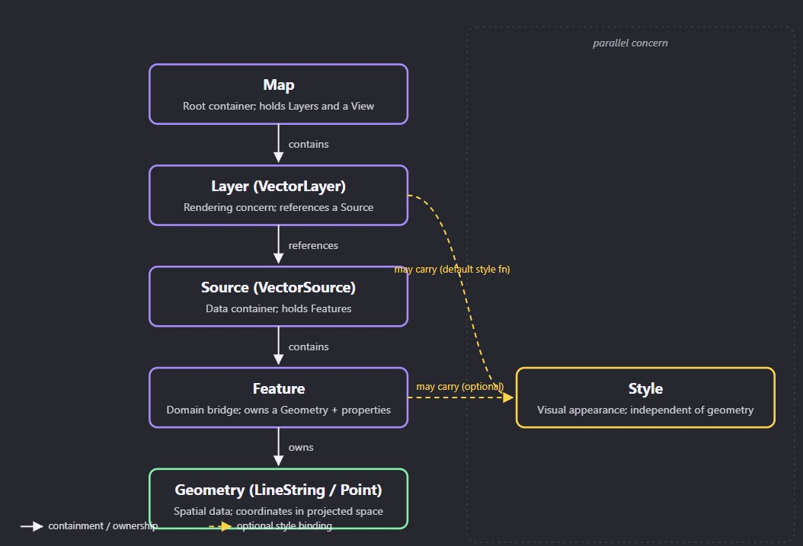

# Layers, Sources, Features, and Geometries

This lesson builds the vector data hierarchy for a tunnel control map, starting from a prediction about what must be recreated when equipment changes and ending with a runnable Angular component that renders a typed tunnel corridor.

> **Learning Objectives**  
> - Add a base TileLayer and a VectorLayer to an existing Angular map host
> - Construct LineString and Point geometries wrapped in Feature objects inside a VectorSource
> - Define a TypeScript TunnelEquipment interface and use Feature properties to bridge domain data to the map
> - Predict which objects stay long-lived versus which are replaced when equipment status changes

## The Update Problem

From the previous lesson, your Angular component initializes an OpenLayers Map with a View centered on a tunnel coordinate, and it disposes that Map cleanly in ngOnDestroy. The Map and View are long-lived — created once, destroyed once. Now you need to populate that map with something operational: a tunnel line stretching between two portals, and five point features representing equipment like cameras, fans, and sensors.

Here is the design tension. If you were drawing this on an HTML canvas from scratch, you would probably maintain a single array of drawable items — lines, circles, labels — and on each frame or update, clear the canvas and redraw everything. When a camera changes status from online to offline, you mutate the item color property in that array and trigger a repaint. That is the naive model: one container of visible things, display properties mutated directly.

Before reading further, consider how you expect OpenLayers to handle this. If a ventilation fan moves from position A to position B, or a camera status changes from normal to alarm, which of these objects do you think you would need to recreate: the Map, the Layer, the Source, the Feature, or none of them? And where would you change the visual appearance — on the geometry, on the feature, on the layer, or somewhere else entirely?

> **Prediction check**  
> Pause and commit to a prediction before continuing. Which objects in the Map, Layer, Source, Feature, Geometry chain should be long-lived (created once), and which should be replaced or mutated when equipment data changes? Write down your instinct — we will test it against the actual architecture.

The naive single-container approach feels natural because it matches how the DOM works — you hold references to elements and mutate their styles. But OpenLayers was designed for a different problem: rendering thousands of features that may be styled differently depending on zoom level, layer configuration, or viewport, where the same geometry might appear on multiple layers with different styling. That requirement forces a separation that the naive model cannot provide.

Before we resolve the prediction, there are two tempting assumptions worth examining. First: if you want a camera feature to appear red when it is in alarm status, you might think you should set a color property on the geometry itself — after all, the geometry is what gets drawn. Second: you might think a Feature is just a lightweight view object that the renderer uses internally, not something you would store meaningful application data on. Consider whether either of these assumptions holds up in a system where the same tunnel geometry might be rendered on a base map in blue and on an alarm overlay in red.

Think about that for a moment. If the geometry carried its own color, how would you render the same tunnel line in two different colors on two different layers simultaneously? The geometry would need to hold conflicting color values. And if the Feature were merely a view object, where would you store the equipment ID, type, and operational status that the feature represents?

> **Geometry is not style; Feature is not view-only**  
> The assumption that geometry carries visual properties seems plausible because in direct canvas drawing, the shape and its color are part of the same draw call. But it breaks down the moment you need to render the same geometry differently across layers or zoom levels — the geometry cannot hold conflicting styles. Similarly, treating a Feature as just a view object fails because the Feature is the bridge between your domain data and the map; its properties carry the equipment ID, type, and status that your click handlers and update logic depend on.

We will see exactly how OpenLayers resolves this when we build the object model in the next section. But the prediction you made above — about what stays long-lived and what gets replaced — is the question this entire lesson investigates.

## The Four-Level Data Hierarchy

The naive model collapses into a single container because it assumes that data, rendering, and styling are one concern. OpenLayers splits them apart so each can vary independently. To see how, we need to trace the ownership chain from the top of the map down to an individual coordinate.



Reading the hierarchy from top to bottom: the Map holds Layers. A Layer is a rendering concern — it decides how something is drawn and at what z-index. A VectorLayer references a Source, which is the data container — it holds the actual Feature objects. A Feature owns a Geometry (the spatial shape) plus a bag of properties (your domain data). Style is deliberately not part of the Geometry; it can be applied per-feature or as a style function on the Layer.

1. Layer — decides what gets rendered and how; it is a rendering concern, not a data container. You create it once and keep it.
2. Source — the data container that holds Feature objects; you add, remove, and update features through it without recreating the Layer. Long-lived and mutated incrementally.
3. Feature — the bridge between your domain data and the map; it owns a Geometry and a properties object. You create features when new equipment appears and remove them when equipment is retired.
4. Geometry — the pure spatial data: a set of coordinates in a projected coordinate reference system. You replace it when an asset moves, but the Feature wrapping it can stay the same.

The separation of style from geometry exists so the same geometry can be rendered differently by different layers. A tunnel LineString might appear as a thick grey tube on a base planning layer and as a flashing red alarm corridor on an incident overlay — same coordinates, same Geometry object, two different Style resolutions. If the geometry carried its own color, this would be impossible.

There is also a third concern living at the top of this chain: the coordinate reference system. The View governs the projection — it defines what projected map space your geometry coordinates are interpreted in. A Point at [1270418, 6045836] means nothing until you know whether the View is in EPSG:3857 (Web Mercator) or EPSG:4326 (lat/lon). The geometry carries raw coordinates; the View gives them a spatial context. We will explore projections deeply in the next lesson, but it matters now because your geometry coordinates must match the View projection or features will render in the wrong place — or not at all.

Now return to your prediction from the opening section. If a camera changes status, which objects need to change? The Map stays. The Layer stays. The Source stays. The Feature stays. You update the Feature properties (the status) — and if the style function reads that property, the visual changes automatically. If the camera moves, you replace the Geometry on the existing Feature. The Source, Layer, and Map are never recreated.

This is the cognitive shift: the Source is the data container, not the Layer. Adding or updating equipment features means calling addFeature, removeFeature, or setProperties on the existing Source or its Features — not destroying and recreating the Layer or the Map. Before we formalize this into code, check your prediction against this model. Did you expect the Source to be the stable mutation point, or did you initially assume the Layer would be replaced?

> **The Layer is not the data container**  
> It is tempting to treat the Layer as the thing that holds your data because it is the visible object on the map. But the Layer is a rendering concern; the Source is the data container. If you recreate the Layer every time equipment changes, you destroy rendering state, event bindings, and style configuration unnecessarily. The Source is designed to be mutated incrementally — add features, remove features, clear and reload — while the Layer stays stable.

## Typing the Tunnel and Building the Layer

With the ownership model in place, we can now build the typed structures. The goal is a small set of TypeScript domain objects representing tunnel equipment, plus the OpenLayers constructors that turn those objects into map features. The domain interface is the contract between your Angular application logic and the map — it is what your services produce and what your map component consumes.

``` TypeScript
// TypeScript domain types for tunnel equipment and portals
export type EquipmentType =
  | 'camera'
  | 'ventilation_fan'
  | 'sensor'
  | 'pump'
  | 'variable_message_sign';

export type EquipmentStatus =
  | 'normal'
  | 'warning'
  | 'alarm'
  | 'offline'
  | 'maintenance';

export interface TunnelEquipment {
  id: string;
  type: EquipmentType;
  /** Coordinates in the View's projected CRS (e.g. EPSG:3857) */
  coordinates: [number, number];
  status: EquipmentStatus;
  label: string;
}

export interface TunnelPortal {
  id: string;
  name: string;
  coordinates: [number, number];
}
```

Notice that TunnelEquipment carries no OpenLayers types. It is a plain interface that any Angular service can produce — a REST API, a WebSocket handler, or a test fixture. The map component's job is to translate these domain objects into OpenLayers Feature objects, using Feature properties as the bridge.

Now the OpenLayers constructors. A Geometry is created from raw coordinates. A Feature wraps a Geometry and carries properties. A VectorSource holds features. A VectorLayer references the source and handles rendering. Here is each piece in isolation before we assemble them.

``` TypeScript
// Constructing Geometry, Feature, VectorSource, and VectorLayer step by step

import { Feature } from 'ol';
import { LineString, Point } from 'ol/geom';
import { Vector as VectorSource } from 'ol/source';
import { Vector as VectorLayer } from 'ol/layer';
import { Tile as TileLayer } from 'ol/layer';

// 1. Geometry: pure spatial data -- coordinates in the View's CRS
const tunnelLine = new LineString([
  [1270000, 6045000], // portal A
  [1270200, 6045200],
  [1270400, 6045400],
  [1270600, 6045600], // portal B
]);

const fanPoint = new Point([1270300, 6045300]);

// 2. Feature: wraps a geometry and carries domain properties
const tunnelFeature = new Feature({
  geometry: tunnelLine,
});
tunnelFeature.setId('tunnel-main');
tunnelFeature.setProperties({
  kind: 'tunnel',
  name: 'North Tunnel',
});

const fanFeature = new Feature({
  geometry: fanPoint,
});
fanFeature.setId('fan-001');
fanFeature.setProperties({
  kind: 'equipment',
  equipmentType: 'ventilation_fan',
  status: 'normal',
  label: 'Fan 001',
});

// 3. Source: the data container -- long-lived, mutated through add/remove
const vectorSource = new VectorSource({
  features: [tunnelFeature, fanFeature],
});

// 4. Layer: rendering concern -- references the source, created once
const vectorLayer = new VectorLayer({
  source: vectorSource,
});
```

Look at how the domain data flows through this chain. The TunnelEquipment interface defines what your application works with. The Feature setProperties call bridges that domain data into the map — the status property on the feature is what a style function will read to decide color, and the equipmentType property is what a click handler will inspect to show the right detail panel.

Before we assemble the full component, try a small construction of your own. Given this equipment object, write the Feature creation code that would wrap it in a Point geometry and set its properties from the domain fields. Think about which fields go into the Point constructor and which go into Feature properties.

``` TypeScript
// Practice: bridge a domain object to an OpenLayers Feature

const camera: TunnelEquipment = {
  id: 'cam-003',
  type: 'camera',
  coordinates: [1270250, 6045250],
  status: 'alarm',
  label: 'Camera 003',
};

// Your task: create a Feature with a Point geometry at camera.coordinates,
// set its id to camera.id, and set properties for type, status, and label.
```

> **Check your construction**  
> The coordinates belong to the Point geometry constructor. The id, type, status, and label belong to Feature properties (and setId). The geometry carries only spatial data; the Feature carries the domain identity and operational state. We will see this pattern repeated in the full worked example next.

One more piece: the base layer. Your tunnel map needs a background for context — typically a tile layer from OSM, Bing, or a custom tile server. This is created as a TileLayer with a tile source, and added to the Map alongside the VectorLayer.

``` TypeScript
// Adding a base TileLayer and the VectorLayer to the Map

import OSM from 'ol/source/OSM';

const baseLayer = new TileLayer({
  source: new OSM(),
});

// Add both layers to the Map (assumes map already exists from previous lesson)
map.setLayers([baseLayer, vectorLayer]);
// or map.addLayer(baseLayer); map.addLayer(vectorLayer);
```

> **Feature is not view-only; Geometry is not style**  
> Two misconceptions surface here. First, you might be tempted to put visual properties like color or stroke width on the Geometry — but geometry is pure coordinates. Style is resolved separately, either per-feature or via a style function on the Layer. Second, you might treat the Feature as a throwaway view object — but it is the bridge that carries your equipment id, type, and status. If you do not set properties on the Feature, your click handlers and style functions have nothing to read.

## Wiring the Full Tunnel Corridor

Now we assemble everything into the Angular map component from the previous lesson. The component already initializes a Map in ngAfterViewInit and disposes it in ngOnDestroy. We will add the base layer, create a VectorSource with the tunnel line, two portals, and five equipment features, then add the VectorLayer to the Map.

``` TypeScript
// Complete Angular component rendering a tunnel corridor with base layer, tunnel line, portals, and equipment


import { Component, AfterViewInit, OnDestroy, ElementRef, ViewChild } from '@angular/core';
import { Map, View } from 'ol';
import { Tile as TileLayer, Vector as VectorLayer } from 'ol/layer';
import { OSM, Vector as VectorSource } from 'ol/source';
import { Feature } from 'ol';
import { LineString, Point } from 'ol/geom';

// Domain types (defined in a shared file, shown here for completeness)
export type EquipmentType = 'camera' | 'ventilation_fan' | 'sensor' | 'pump' | 'variable_message_sign';
export type EquipmentStatus = 'normal' | 'warning' | 'alarm' | 'offline' | 'maintenance';

export interface TunnelEquipment {
  id: string;
  type: EquipmentType;
  coordinates: [number, number]; // already in EPSG:3857
  status: EquipmentStatus;
  label: string;
}

export interface TunnelPortal {
  id: string;
  name: string;
  coordinates: [number, number];
}

@Component({
  selector: 'app-tunnel-map',
  template: '<div #mapEl class="map-container"></div>',
  styles: ['.map-container { width: 100%; height: 100vh; }'],
})
export class TunnelMapComponent implements AfterViewInit, OnDestroy {
  @ViewChild('mapEl') mapEl!: ElementRef<HTMLDivElement>;

  private map!: Map;
  private vectorSource!: VectorSource;

  // Tunnel corridor definition -- in a real app this comes from a service
  private readonly tunnelLineCoords: number[][] = [
    [1270000, 6045000],
    [1270200, 6045200],
    [1270400, 6045400],
    [1270600, 6045600],
  ];

  private readonly portals: TunnelPortal[] = [
    { id: 'portal-a', name: 'North Portal', coordinates: [1270000, 6045000] },
    { id: 'portal-b', name: 'South Portal', coordinates: [1270600, 6045600] },
  ];

  private readonly equipment: TunnelEquipment[] = [
    { id: 'cam-001', type: 'camera', coordinates: [1270100, 6045100], status: 'normal', label: 'Camera 001' },
    { id: 'fan-001', type: 'ventilation_fan', coordinates: [1270300, 6045300], status: 'normal', label: 'Fan 001' },
    { id: 'sensor-001', type: 'sensor', coordinates: [1270200, 6045200], status: 'warning', label: 'Sensor 001' },
    { id: 'pump-001', type: 'pump', coordinates: [1270450, 6045450], status: 'normal', label: 'Pump 001' },
    { id: 'vms-001', type: 'variable_message_sign', coordinates: [1270500, 6045500], status: 'offline', label: 'VMS 001' },
  ];

  ngAfterViewInit(): void {
    this.map = new Map({
      target: this.mapEl.nativeElement,
      layers: [
        new TileLayer({ source: new OSM() }),
        this.buildVectorLayer(),
      ],
      view: new View({
        center: [1270300, 6045300],
        zoom: 15,
      }),
    });
  }

  private buildVectorLayer(): VectorLayer {
    // Source is long-lived -- store reference for future updates
    this.vectorSource = new VectorSource();

    // 1. Tunnel line feature
    const tunnelLine = new LineString(this.tunnelLineCoords);
    const tunnelFeature = new Feature({ geometry: tunnelLine });
    tunnelFeature.setId('tunnel-main');
    tunnelFeature.setProperties({
      kind: 'tunnel',
      name: 'North Tunnel',
    });
    this.vectorSource.addFeature(tunnelFeature);

    // 2. Portal features
    for (const portal of this.portals) {
      const point = new Point(portal.coordinates);
      const feature = new Feature({ geometry: point });
      feature.setId(portal.id);
      feature.setProperties({
        kind: 'portal',
        name: portal.name,
      });
      this.vectorSource.addFeature(feature);
    }

    // 3. Equipment features -- loop over typed domain array
    for (const eq of this.equipment) {
      const point = new Point(eq.coordinates);
      const feature = new Feature({ geometry: point });
      feature.setId(eq.id);
      feature.setProperties({
        kind: 'equipment',
        equipmentType: eq.type,
        status: eq.status,
        label: eq.label,
      });
      this.vectorSource.addFeature(feature);
    }

    return new VectorLayer({
      source: this.vectorSource,
    });
  }

  ngOnDestroy(): void {
    this.map.setTarget('');
    this.map.dispose();
  }
}
```

Trace through the construction. The buildVectorLayer method creates the VectorSource once, stores the reference on the component for future updates, then adds features one by one. The tunnel line is a LineString with four coordinate pairs. Each portal and equipment item is a Point feature with properties bridging the domain data. The VectorLayer wraps the source and is added to the Map alongside the base tile layer.

Now try a variation. What if sensor-001 moves to a new position at [1270250, 6045250]? Using the vectorSource reference stored on the component, how would you update it? Think about whether you need to recreate the Feature, the Geometry, or neither — and write the update line before reading on.

> **The update pattern**  
> You would call const feature = this.vectorSource.getFeatureById('sensor-001'); feature.setGeometry(new Point([1270250, 6045250])); — the Geometry is replaced on the existing Feature. The Feature, Source, Layer, and Map all stay. If only the status changes, it is even simpler: feature.set('status', 'alarm'); and a style function reading that property would update the visual automatically.

> **Common mistakes in source and feature lifecycle**  
> Three pitfalls to watch for: (1) Creating a new VectorSource on every update instead of reusing the existing one — this destroys all features, triggers a full re-render, and loses any event bindings on the source. (2) Storing Angular component state like ViewChild references, Observable subscriptions, or ChangeDetectorRef inside Feature properties — Feature properties are for domain data the map needs, not Angular plumbing. (3) Mixing coordinate systems — if your equipment coordinates arrive in EPSG:4326 (lon/lat) but the View is EPSG:3857, you must transform them with fromLonLat() before creating the Point geometry, or features will render at the wrong location or disappear entirely.

The vectorSource reference stored on the component is the key to all future updates. When a WebSocket pushes a status change for fan-001, you call this.vectorSource.getFeatureById('fan-001') and update its status property. When new equipment is installed, you create a new Feature and call this.vectorSource.addFeature(). When equipment is decommissioned, you call removeFeature. The Layer and Map are never touched.

## Ownership Boundaries and What Comes Next

The hierarchy we built — Map, Layer, Source, Feature, Geometry — is not just a structural pattern. It is an ownership contract that determines what you create once, what you mutate incrementally, and what you replace when data changes. Getting this right now means the difference between a map that handles five equipment points as a demo and one that scales to the 50,000-point tunnel system the later modules target.

1. Map — long-lived. Created in ngAfterViewInit, disposed in ngOnDestroy. Never recreated for data updates.
2. Layer (VectorLayer) — long-lived. Created once with a reference to its Source. Never recreated for data updates; its style function may read Feature properties.
3. Source (VectorSource) — long-lived and mutated incrementally. addFeature, removeFeature, getFeatureById are your update API. Do not recreate it on status changes.
4. Feature — created when equipment appears, removed when equipment is retired. Properties are updated in place for status changes. The Feature is the bridge between domain data and the map, not a throwaway view object.
5. Geometry — replaced when an asset moves via setGeometry on the existing Feature. Coordinates must match the View projection.
6. Style — independent of geometry. Applied per-feature or as a style function on the Layer. The same geometry can render differently across layers.

Consider what happens when the equipment count grows from 5 to 50,000. The ownership contract does not change — the Source is still the mutation point, the Layer still renders, the Feature still bridges domain data. What changes is the performance strategy: you will need viewport-based loading, clustering or aggregation, and eventually WebGL-capable layers to avoid rendering 50,000 DOM nodes simultaneously. Those techniques build directly on top of this hierarchy. If the Source were not already the stable mutation point, none of them would work.

The coordinate reference system question — why those coordinates are [1270000, 6045000] and not latitude/longitude — is the focus of the next lesson. You have been using EPSG:3857 (Web Mercator) coordinates implicitly because the default View projection is Web Mercator and the OSM tile layer is in that projection. But real tunnel data often arrives in WGS84 lat/lon (EPSG:4326) or a national grid. Understanding how to transform between projections, and why the View governs the coordinate space, is what prevents features from silently rendering in the wrong location.

Further ahead in the curriculum, this Source-Feature-Geometry separation is what makes clustering possible (the Source provides features to a clustering wrapper), what enables incremental WebSocket updates (mutate individual features without re-rendering the layer), and what allows WebGL point rendering to swap the Layer implementation while keeping the same Source. The architecture you built today is the foundation for every performance optimization to come.

## Conclusion
The OpenLayers vector hierarchy separates concerns so each can vary independently: the Layer renders, the Source holds data, the Feature bridges domain to map, the Geometry carries spatial coordinates, and Style is applied independently. When equipment status changes, you mutate properties on the existing Feature through the existing Source — the Map, Layer, and Source are never recreated. When equipment moves, you replace the Geometry on the existing Feature. This ownership contract is the foundation that makes clustering, viewport-based loading, and high-volume rendering possible in later modules.

**Next:**  
*In the next lesson, explore coordinate reference systems and projections in depth — why the View governs the coordinate space, how to transform between EPSG:4326 and EPSG:3857, and how to ensure your tunnel equipment coordinates render in the correct location regardless of the source data native projection.*
