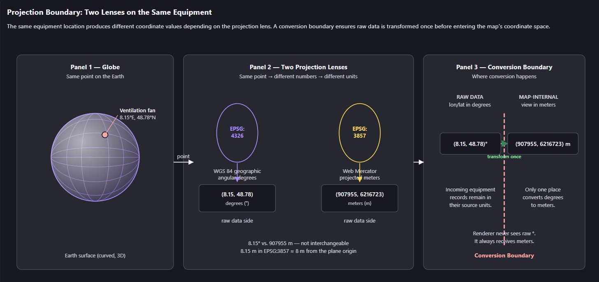

# Coordinates and Projection Boundaries
This lesson investigates a concrete coordinate-misalignment failure in a tunnel control system, builds a mental model of why projections differ, and establishes a formal boundary service that converts coordinates once at the data ingestion edge so that all downstream code works exclusively in the map projection.

> **Learning Objectives**
> - Diagnose why longitude-latitude coordinates rendered at the wrong location on an OpenLayers map
> - Distinguish between EPSG:4326 and EPSG:3857 and explain why they are not interchangeable
> - Implement an Angular service that acts as the single coordinate-conversion boundary
> - Avoid common pitfalls such as converting coordinates inside style functions or component templates

## The Tunnel Map That Plotted Everything Near the Equator

The tunnel corridor stretches through a mountainous region at roughly 48°N latitude. Your backend delivers equipment positions as decimal degrees: longitude 8.15, latitude 48.78. You pass these numbers directly into an OpenLayers Feature with a Point geometry, add the feature to a vector source, and load the map.

The base layer looks correct — the OpenStreetMap tiles show the expected terrain. But every equipment marker sits clustered near the coordinate origin (0, 0), off the coast of Africa, instead of along the tunnel corridor in the Alps.

Before reading on, predict what you think went wrong. Is it a data issue from the backend, a styling problem, a layer ordering mistake, or something about how the coordinates themselves are being interpreted? Consider what evidence would distinguish each of these causes — then check your reasoning against what follows.

Let us trace the evidence. Open the browser console and inspect the three numbers that matter: the feature's geometry coordinates, the view's projection code, and the view's center.

``` TypeScript
const feature = source.getFeatures()[0];
console.log(feature.getGeometry()!.getCoordinates()); // [8.15, 48.78]
console.log(map.getView().getProjection().getCode());  // "EPSG:3857"
console.log(map.getView().getCenter());               // [907955, 6216723]
```

The numbers reveal the mismatch in kind, not just in value. The feature holds 8.15 and 48.78. The view center is 907955 and 6216723. The projection code is EPSG:3857 — Web Mercator, measured in meters. Nothing in the pipeline converted the degrees into meters. The base layer tiles were served in EPSG:3857, the View is configured for EPSG:3857, and the feature coordinates were passed in as-is from EPSG:4326. OpenLayers interpreted 8.15 meters and 48.78 meters — a point near the origin of the Web Mercator plane, not near 48°N.

This is the turning point. The map did not silently convert your degrees into meters, and it did not throw an error. It treated the raw numbers as if they were already in the view's coordinate system. The result: a visually correct base map with equipment rendered at a location that is mathematically consistent but geographically wrong.

> **Misconception: OpenLayers and Angular Share the Same Coordinate System**  
> It is tempting to assume that longitude-latitude coordinates can be passed directly to OpenLayers features and that the map will handle any necessary projection conversion automatically. This seems plausible because web maps appear to 'just work' when you add tile layers — the tiles render in the right place without any explicit projection configuration. But OpenLayers does not inspect your coordinate values and guess their projection. A geometry is just an array of numbers with no CRS metadata attached. When those numbers do not match the View's projection, features render at internally consistent but geographically wrong locations, exactly as we saw: 8.15 meters from the origin instead of 8.15 degrees east.

This failure raises the central question for the rest of the lesson: how do we establish a single, reliable boundary that converts longitude-latitude equipment data into the map projection and keeps all downstream code free of projection concerns?

A quick-fix temptation emerges here: patch the conversion directly in the component that builds features — call fromLonLat on each coordinate, construct the Point, and move on. The map looks right within minutes. But now consider what happens next. A teammate builds a click-popup that converts a clicked map coordinate back to longitude-latitude for the asset API. Another builds a measurement tool that calculates distances between equipment. A third writes a clustering aggregation that reads feature coordinates. Predict: does the component-local fix hold up for these three consumers? What must each of them do, and what happens if one forgets?

> **Misconception: Coordinate-Conversion Logic Is a Presentation Concern**  
> Because the symptom appeared on screen — equipment rendered in the wrong place — it feels natural to fix it where the symptom is visible: inside the component that creates features. This breaks down the moment a second consumer touches coordinates. The popup needs the inverse conversion, the measurement tool needs to know the coordinates are in meters, and the clustering code needs consistency across all features. A component-local fix leaves every other consumer to independently remember the rule, and a missed conversion is invisible at compile time because number[] cannot distinguish degrees from meters. The failure only surfaces at runtime as a wrong-location feature. A dedicated boundary service eliminates this by being the only place that knows about the source CRS — every consumer downstream receives coordinates already in the map projection.

There is a trade-off to acknowledge before we formalize the boundary. Converting once at ingestion means downstream simplicity, but it requires that we identify the projection of every data feed before it crosses the boundary. The alternative — converting on demand wherever coordinates are consumed — preserves direct access to raw degrees but scatters projection logic across every component, style function, and interaction. For a tunnel control system where dozens of equipment types and multiple developers will touch coordinates, the scattered approach is a bug factory. The boundary we choose accepts one upfront cost (knowing the source CRS of each feed) to guarantee that every downstream consumer can trust its coordinates.

## Two Lenses on the Same Earth

A projection is a strategy for flattening the curved surface of the Earth onto a flat plane — a screen, a tile, or a canvas. No single projection can do this without distortion, because you cannot flatten a sphere without stretching or compressing some part of it. Different projections accept different kinds of distortion to serve different purposes.

Think of a projection as a lens. The same point on the Earth's surface — a ventilation fan at 8.15°E, 48.78°N — produces a different pair of numbers depending on which lens you look through. EPSG:4326, the WGS 84 geographic coordinate system, measures position in angular degrees. EPSG:3857, Web Mercator, measures position in meters on a projected plane. Same location on the Earth. Different numbers. Different units.



Now consider what happens when you zoom into a tunnel corridor. At the scale of a few kilometers, Web Mercator introduces minimal distortion — it is perfectly adequate for rendering equipment on an operational map. But it is still measuring in meters, not degrees. The two systems are not interchangeable: 8.15 in EPSG:4326 is a longitude near Switzerland. The number 8.15 in EPSG:3857 is roughly 8 meters from the origin of the entire projected plane.

Before moving on, try to explain in your own words: if someone said 'just pass the longitude and latitude directly, the map will figure it out,' what specifically would go wrong at the coordinate level? What would the renderer do with the number 8.15 if the View expects meters?

> **Misconception: EPSG:4326 and EPSG:3857 Are Interchangeable Without Conversion**
> Because both systems describe positions on the same Earth, it is easy to assume the coordinate values can be used interchangeably and that OpenLayers will sort out the difference. This breaks down immediately in practice: EPSG:4326 uses angular degrees (longitude range -180 to 180, latitude range -90 to 90), while EPSG:3857 uses projected meters (x range about -20 million to 20 million, y range about -20 million to 20 million). Passing a degree value like 8.15 into a meter-based coordinate space places the point 8.15 meters from the origin — not at 8.15 degrees east. The numbers are on completely different scales, and no library can infer which scale you intended from a bare number.

## The OpenLayers Projection and Transform API

Once you accept that two projection lenses produce different numbers for the same location, the practical question becomes: where and how do you convert? OpenLayers provides a transform function and proj4js provides registration for custom projections. The key is to use them at exactly one point in your application.

OpenLayers includes built-in definitions for common projections like EPSG:4326 and EPSG:3857. For tunnel-specific or national coordinate reference systems — such as EPSG:2056 (Swiss LV95) — you register the projection definition via proj4js before using it.

``` TypeScript
// Registering a custom projection with proj4js
import { register } from 'ol/proj/proj4';
import proj4 from 'proj4';

// Define the Swiss LV95 projection
proj4.defs('EPSG:2056',
  '+proj=somerc +lat_0=46.95240555555556 +lon_0=7.439583333333333 ' +
  '+k_0=1 +x_0=2600000 +y_0=1200000 +ellps=bessel ' +
  '+towgs84=674.374,15.056,405.346,0,0,0,0 +units=m +no_defs'
);

// Make the definition available to OpenLayers
register(proj4);
```

Once projections are registered, the transform function converts a coordinate from one CRS to another. The function takes a coordinate array, a source projection identifier, and a destination projection identifier.

``` TypeScript
import { transform } from 'ol/proj';

// Convert a single coordinate from degrees to Web Mercator meters
const lonLat: [number, number] = [8.15, 48.78];
const webMercator: [number, number] = transform(
  lonLat,
  'EPSG:4326',  // source: degrees
  'EPSG:3857'   // destination: meters
);
// Result: approximately [907955, 6216723]
```

For bulk conversion, transformExtent converts a bounding box, and you can map transform over an array of coordinates. The function signature is the same in each case — source CRS, destination CRS — but the boundary principle is what matters more than the syntax.

Consider what happens if you do not enforce a boundary. One developer adds a feature and remembers to convert. Another developer adds a style function that reads the feature's coordinates and applies a secondary conversion — not realizing the values are already in EPSG:3857. The transform function faithfully applies the projection math a second time to already-correct values, and the feature jumps to a new wrong location. A third developer reads coordinates from the source for a distance calculation and gets meter values but assumes they are degrees. The boundary rule eliminates this entire class of bugs by making the projection state of every coordinate predictable: if it is past the boundary, it is in the map projection.

> **The Boundary Rule**  
> Convert coordinates once, at the data ingestion edge — the moment raw data enters your application from an external source (API, WebSocket, file). After that conversion, every feature, geometry, interaction, and style function works exclusively in the map projection. No downstream code should ever need to know what the original coordinate system was, because all coordinates are already in the map's CRS. This is justified because a single conversion at ingestion guarantees that no double-conversion or missed-conversion bugs can occur later in the pipeline — every consumer receives coordinates that are already in the correct projection.

There is a comparative trade-off to note between the two approaches. The built-in transform function handles common projections like EPSG:4326 to EPSG:3857 without external dependencies. proj4js adds a dependency but unlocks any CRS with a PROJ string — essential if your tunnel system uses a national grid or a custom engineering CRS. For a tunnel control system that may span national borders or use survey-grade coordinates, the flexibility of proj4js usually outweighs the size cost.

> **Misconception: OpenLayers Auto-Detects and Converts Coordinate Systems**  
> Because OpenLayers renders base tiles correctly regardless of their source projection, it is natural to assume it also auto-detects the projection of your feature coordinates. It does not. OpenLayers trusts that the coordinates you pass to a Feature geometry match the projection the View is configured for. If the View uses EPSG:3857 (the default), every coordinate you provide must already be in EPSG:3857 meters — or must be explicitly transformed before being added to a source. There is no automatic inspection of coordinate values to infer their CRS, because a bare number cannot tell the library whether it represents degrees or meters.

## Building the Projection Boundary Service

Now we put the boundary rule into practice with a concrete worked example. The goal is a single Angular service that accepts raw coordinates in their source projection, converts them to the map projection, and returns the result. Every component, interaction, and style function downstream receives coordinates that are already in EPSG:3857.

Consider the equipment data that arrives from the asset registry: an array of objects, each with an identifier, a type, and a longitude-latitude pair. The service must take this shape as input and produce a mapped shape whose coordinates are in meters. The key design decision is that the output interface carries a field named mapCoordinate — not lonLat, not coordinate, but mapCoordinate — so that any developer reading downstream code knows immediately which coordinate space they are in.

``` TypeScript
import { Injectable } from '@angular/core';
import { transform } from 'ol/proj';
import { register } from 'ol/proj/proj4';
import proj4 from 'proj4';

export interface EquipmentPosition {
  id: string;
  type: 'fan' | 'camera' | 'sign' | 'pump' | 'sensor' | 'phone';
  lonLat: [number, number]; // raw degrees from the backend
}

export interface MappedEquipment {
  id: string;
  type: EquipmentPosition['type'];
  mapCoordinate: [number, number]; // EPSG:3857 meters
}

@Injectable({ providedIn: 'root' })
export class ProjectionBoundaryService {
  private readonly sourceCrs = 'EPSG:4326';
  private readonly mapCrs = 'EPSG:3857';

  constructor() {
    // Register proj4js if custom projections are needed.
    // For standard EPSG:4326 -> EPSG:3857, OpenLayers handles it natively.
    register(proj4);
  }

  /** Convert a single coordinate pair from the source CRS to the map CRS. */
  toMapCoordinate(lonLat: [number, number]): [number, number] {
    return transform(lonLat, this.sourceCrs, this.mapCrs);
  }

  /** Convert an array of equipment positions into mapped features. */
  toMappedEquipment(items: EquipmentPosition[]): MappedEquipment[] {
    return items.map(item => ({
      id: item.id,
      type: item.type,
      mapCoordinate: this.toMapCoordinate(item.lonLat),
    }));
  }

  /** Convert a bounding box from the source CRS to the map CRS. */
  toMapExtent(extent: [number, number, number, number]): [number, number, number, number] {
    return transform(extent, this.sourceCrs, this.mapCrs);
  }
}
```

Walk through what happens when the map component calls toMappedEquipment with the first three items from the asset registry. The input is an array of EquipmentPosition objects with lonLat values like [8.15, 48.78], [8.151, 48.781], and [8.149, 48.779]. The service maps over the array, calls transform on each pair with 'EPSG:4326' as source and 'EPSG:3857' as destination, and returns MappedEquipment objects whose mapCoordinate values are approximately [907955, 6216723], [908066, 6216856], and [907843, 6216589]. The component then creates new Point(mapped.mapCoordinate) for each item — no transform call in the component, no projection string in the component, no knowledge of EPSG:4326 anywhere past the service boundary.

Notice what this service does not do: it does not import any OpenLayers rendering objects (Map, View, Layer, Feature). It does not interact with the DOM. It does not run inside Angular's change detection cycle. It is a pure transformation layer — a function from one coordinate space to another. This separation is deliberate: coordinate conversion is a data transformation, not a presentation concern.

> **Misconception: Coordinate-Conversion Logic Is a Presentation Concern**  
> It might seem natural to convert coordinates inside an Angular component or a template expression, since that is where feature data meets the map. But placing conversion logic in components spreads projection awareness across the UI layer, making it impossible to guarantee that every coordinate has been converted exactly once. A dedicated service acts as the single boundary: it is the only place in the codebase that knows about the source CRS, and every consumer downstream receives coordinates that are already in the map projection.

Consider a scenario where a developer needs to display a tooltip showing the equipment's original longitude and latitude alongside its map position. If conversion is scattered across components, the developer might reverse-engineer the degrees by converting back — introducing rounding errors. With the boundary service, the original EquipmentPosition (with its lonLat field) is still available as the source of truth, and the MappedEquipment provides the converted coordinate. Both representations coexist without ambiguity.

> **Misconception: Converting Coordinates Inside a Style Function Is Safe**  
> A style function runs on every render frame for every feature in the viewport. If you place a transform call inside a style function, you are re-converting coordinates that are already in the map projection — which produces wrong locations — and you are doing it hundreds or thousands of times per render cycle. The style function should read coordinates that are already in the map CRS and use them directly. Conversion happens once at ingestion, never during rendering.

Before reading the pitfalls list below, predict: what would happen if a developer called transform on a coordinate that was already in EPSG:3857, passing 'EPSG:4326' as the source? Would the function throw an error, or would it silently produce a result?

The function would not throw. It would treat the meter values as if they were degrees and project them into an enormous, wrong extent. No runtime error would alert the developer — the failure would only be visible as a feature that disappears far outside the visible map area. This is the silent failure mode that the boundary rule exists to prevent.

1. Double conversion: A developer calls transform on coordinates that are already in EPSG:3857, passing 'EPSG:4326' as the source. The result is geographically meaningless but does not throw an error. Fix: enforce the boundary so that only the ProjectionBoundaryService ever calls transform, and only on raw data that has not yet been converted.  
*Symptom:* features disappear or render at extreme coordinates far outside the visible extent.

2. CRS string mismatch: Using 'EPSG:4326' in one place and 'WGS84' in another. OpenLayers recognizes both, but mixing identifiers makes it harder to audit. Fix: define constants in one location and reference them everywhere.  
*Symptom:* code works but is fragile — a future refactor that removes one alias silently breaks the other.

3. Precision loss from chaining: Converting through an intermediate projection (e.g., EPSG:4326 to EPSG:2056 to EPSG:3857) accumulates floating-point error. Fix: convert directly from source to destination in a single transform call whenever possible.

4. NgZone performance: If you convert large arrays of coordinates inside Angular's zone, each transform call can trigger change detection overhead. For bulk conversions (thousands of equipment positions), run the conversion outside NgZone using runOutsideAngular, then re-enter the zone only when pushing results to the component.

> **Misconception: All Coordinate Conversions Are Expensive**  
> It is reasonable to worry about performance when converting thousands of equipment coordinates. In practice, a single EPSG:4326 to EPSG:3857 transform call is a lightweight mathematical operation — a few multiplications and additions. The real performance risk is not the conversion itself but where it happens: calling transform inside a render loop or style function is expensive because it repeats unnecessary work on every frame, not because the math is slow. Converting once at ingestion, even for thousands of points, is negligible.

## Defining the Boundary Contract and Looking Ahead

The projection boundary is not just a code pattern — it is a project contract. Every developer who touches the tunnel control system agrees: raw coordinates enter the application in their source CRS, the ProjectionBoundaryService converts them once, and everything downstream works in the map projection. No exceptions, no inline transforms in components, no conversion calls in style functions.

There is also a dimension of cartographic judgment to acknowledge. Choosing EPSG:3857 for the operational map is not the only valid choice. A tunnel authority that needs survey-grade accuracy might prefer a national grid like EPSG:2056 for engineering measurements, accepting the added complexity of proj4js registration. A system spanning multiple countries might standardize on Web Mercator for simplicity and accept its distortions at high latitudes. The boundary principle holds regardless of which projection you choose — the contract is about having one conversion point, not about which lens is objectively correct.

Try this exercise: write down the boundary contract for your tunnel application in two or three sentences. Specify the source CRS of your incoming data, the map CRS, and the single service method that performs the conversion. Then identify where in your existing Angular component you would call that method — it should be at the point where HTTP or WebSocket data is received, before features are created.

The second exercise is to wire the ProjectionBoundaryService into the map component you built in the previous lessons. If your component currently creates features from raw longitude-latitude coordinates, refactor it so that it calls toMappedEquipment on the incoming data and uses the resulting mapCoordinate values for the Point geometry. The component should have no knowledge of EPSG:4326 after the refactor.

With the projection boundary in place, the tunnel control system now has a clean separation: raw geospatial data enters through one door, and everything inside the application speaks the same coordinate language. This sets up the next module, where you will model tunnel equipment as typed TypeScript domain objects — fans, cameras, signs, pumps, sensors — and define how those objects map to OpenLayers features without leaking projection concerns into the domain layer. You will also explore viewport-based loading strategies that fetch equipment data by extent, where the boundary service's toMapExtent method will become the bridge between the map's visible area and the backend's spatial query.

## Conclusion
You investigated a real coordinate-misalignment failure, saw that OpenLayers treats coordinate values as belonging to whatever projection the View expects — and does not auto-convert — and established a formal boundary: one service, called once at the data ingestion edge, converts raw coordinates to the map projection so that every downstream component, style function, and interaction works exclusively in EPSG:3857. The projection boundary is both a code pattern and a project contract that prevents an entire class of double-conversion and missed-conversion bugs.  
**Next:**  
*In the next module, you will build typed TypeScript domain models for tunnel equipment, design the mapping between domain objects and OpenLayers features, and implement viewport-based data loading that uses the projection boundary service's extent conversion to query the backend for equipment within the visible map area.*